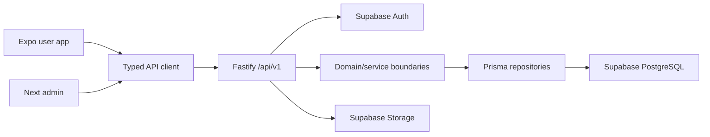

# SARIRA — Phase 2 Final Report

**Version:** 0.2.0  
**Date:** 8 August 2026  
**Status:** Production foundation implemented; external staging deployment awaits provider credentials and owner review. Phase 3 not started.

## 1. Implementation summary

Phase 1 UI was migrated, not rebuilt. The repository now contains a cross-platform Expo user app, Next.js admin foundation, Fastify API, PostgreSQL/Prisma data foundation, Supabase Auth/Storage adapters, shared validation/config/logger/API-client packages, role and audit boundaries, CI, staging manifests, 16 automated tests, database integration verification, and complete architecture handoff.

No health recommendation engine, AI, RAG, nutrition engine, wearable sync, or other Phase 3 logic was added.

## 2. Final architecture



Full rationale: `docs/architecture/SYSTEM_ARCHITECTURE.md`.

## 3. Repository structure

- `apps/user-app`: Expo, Phase 1 screens, auth providers/services, protected routes.
- `apps/admin-web`: Next.js 16 login/dashboard/access-denied/profile.
- `apps/api`: Fastify routes, adapters, repositories, domain boundaries, tests.
- `packages`: UI, tokens, types, validation, API client, config, logger, three Phase 2 placeholders.
- `prisma`: schema, seed, one migration.
- `infrastructure`: Docker, environment templates, Supabase SQL, deployment/monitoring notes.
- `docs`: product/design/architecture/API/database.
- `.github/workflows`: CI and manual staging deploy.

## 4. Main libraries and reasons

| Library | Reason |
|---|---|
| Expo / React Native / Expo Router | One user app across iOS, Android, tablet, desktop, web |
| Next.js 16 App Router | Maintained admin SSR foundation and Proxy auth gate |
| Fastify 5 | Lightweight modular plugin encapsulation |
| Prisma 7 + pg adapter | Type-safe repositories and reviewed migrations |
| Supabase JS + SSR | Shared email auth; native persistence and admin cookies |
| Zod 4 | Shared client/server schemas; server authoritative |
| Vitest + Fastify inject | Fast, isolated API and integration tests |
| Jest / Testing Library RN | Existing cross-platform component tests retained |
| pgvector PostgreSQL image | Migration-ready vector extension without RAG |

## 5. Database schema

Entities: User, Profile, RoleAssignment, DependentProfile, ConsentVersion, UserConsent, Goal, SafetyScreeningSession, SafetyAnswer, SafetyResult, AppPreference, DeviceSession, AuditLog. UUID is consistent; DOB replaces permanent age. Identity and health profile are separate. Details: `docs/database/DATA_MODEL.md`.

## 6. Migration

`20260808070934_phase2_foundation` creates foundation tables, enums, indexes, relations, and enables the `vector` extension. It was applied to a local PostgreSQL 17 + pgvector database; Prisma status reported schema up to date. Seed creates three draft consent versions only.

## 7. API endpoints

`GET /health`, `GET /version`, `POST /auth/register`, `POST /auth/login`, `POST /auth/logout`, `GET /me`, `GET/PATCH /profiles/me`, `GET /consents`, `PUT /consents/:type`, `GET /goals`, all under `/api/v1`. Details: `docs/api/API_V1.md`.

## 8. Authentication flow

Expo restores Supabase/mock sessions, redirects protected routes, persists native sessions through AsyncStorage, supports registration/login/logout/reset, and sends Bearer tokens through the API client. Admin uses Supabase SSR cookies and Next Proxy. OAuth is a credential-free placeholder boundary only.

## 9. Authorization flow

API verifies identity, loads internal account and database roles, then applies role requirements; `SUPER_ADMIN` can satisfy all role guards. Admin Proxy uses JWT metadata only as an optimistic gate. Ownership/role checks at API remain authoritative.

## 10. Environments

Development, staging, and production templates exist. Development defaults to local database and mock auth/data. Staging and production require separate Supabase projects and real server secrets. No secret is placed in the client schema.

## 11. Development commands

```bash
pnpm install
pnpm db:generate
pnpm dev:user
pnpm dev:admin
pnpm dev:api
```

## 12. Test commands

```bash
pnpm test
pnpm check
```

For real DB integration, set local `DATABASE_URL` before `pnpm --dir apps/api test`.

## 13. Migration commands

```bash
pnpm db:validate
pnpm db:migrate:dev --name <scope>
pnpm db:migrate:deploy
pnpm db:migrate:status
pnpm db:seed
```

`migrate dev` is local-only.

## 14. Staging URL

Not available. No Supabase/Vercel/Render staging credential, project ID, or deployment hook was present. Manifests and manual deployment workflow are ready; no URL is fabricated. This keeps acceptance criterion 19 open.

## 15. Quality results

| Gate | Result |
|---|---|
| Reproducible dependency install (`--frozen-lockfile`) | Passed |
| Expo dependency compatibility | Up to date |
| Lint | User, admin, API passed |
| Typecheck | User, admin, API passed |
| User tests | 3 suites, 9 tests passed |
| API unit/API tests | 1 suite, 6 tests passed |
| PostgreSQL integration | 1 suite, 1 test passed |
| Database migration | Applied; up to date |
| User builds | iOS, Android, web bundles passed; 37 static routes |
| Admin build | Passed; 6 app routes + Proxy |
| API build/runtime | Passed; bundled server health returned success |
| Browser QA | Mobile/tablet/desktop passed; no overflow/console errors |

Native bundle verification passed. Native simulator runtime was not executed because Xcode Simulator and Android SDK/emulator are absent on this machine.

## 16. Commit list

This workspace is not a Git repository, so no actual commits exist. Recommended conventional slices:

1. `refactor(repo): migrate prototype to user app workspace`
2. `feat(auth): add Supabase session and route guard foundation`
3. `feat(api): add Fastify v1 foundation and response conventions`
4. `feat(database): add Prisma models and phase2 migration`
5. `feat(admin): add Next admin access foundation`
6. `feat(infra): add CI and staging manifests`
7. `test(foundation): add API database and route tests`
8. `docs(architecture): add Phase 2 handoff`

Do not manufacture these as one retrospective giant commit.

## 17. Changes from Phase 1

- Renamed `apps/prototype` to `apps/user-app` and added route groups.
- Kept 60 mock screens, design tokens, UI, layouts, navigation, and responsive behavior.
- Replaced inert demo auth with mock/real AuthService boundary.
- Added missing production UI states/components and responsive hook.
- Added admin, API, database, validation, logging, CI, and deployment foundation.
- Browser QA found a logout/guard navigation race; logout now explicitly targets `/login`.

## 18. Technical debt

- Phase 1 domain screens still use generic renderers and mock data.
- API service/use-case layer is intentionally thin for Phase 2 endpoints.
- Consent repository can create development placeholder versions; staging must restrict to approved versions.
- No automated Playwright/device E2E or visual regression.
- No server-state cache library until real feature endpoints justify it.
- No destructive migration rehearsal/rollback automation.

## 19. Security risks

- Admin role provisioning and break-glass workflow are not implemented.
- Rate limits/CORS are foundation values and need staging load/threat tuning.
- No penetration test, WAF/DDoS plan, SBOM/signing, mobile attestation, or key-rotation drill.
- Supabase/hosting regional and contractual posture needs Security/Legal review.
- Audit-log access/retention controls require production policy.

## 20. Privacy concerns

Guardian authority, minor assent, lawful basis, retention/deletion, export verification, health-data classification, residency, vendor DPAs, and incident obligations still need approval. No compliance claim is made.

## 21. Not implemented

Baseline 14-day logic, Pattern Map engine, Weekly Action engine, expert system, AI/RAG, nutrition calculation, food recognition/barcode, wearable integrations, Motion Coach vision, Growth Path rules, stunting screening, digestive analysis, production notifications, payment/marketplace/order/subscription, production analytics, or health recommendations.

## 22. Acceptance criteria

| # | Criterion | Status |
|---:|---|---|
| 1 | Final monorepo documented | Met |
| 2 | Phase 1 UI retained/migrated | Met |
| 3 | Web/iOS/Android development | Partial: web runtime + all bundles pass; simulators unavailable |
| 4 | Admin foundation | Met |
| 5 | API runs | Met |
| 6 | PostgreSQL connected | Met locally |
| 7 | Prisma migration runs | Met |
| 8 | Authentication foundation | Met; real provider needs staging credentials |
| 9 | Protected route | Met |
| 10 | Profile foundation | Met |
| 11 | Consent foundation | Met |
| 12 | Roles/authorization | Met |
| 13 | Shared validation | Met |
| 14 | Central errors | Met |
| 15 | Structured logging | Met |
| 16 | Audit log foundation | Met |
| 17 | Development/staging separated | Met |
| 18 | CI lint/type/test/build | Workflow complete; local equivalent passed |
| 19 | Staging deployment | Open: provider credentials unavailable |
| 20 | No repository/client secret | Met by configuration and scan |
| 21 | No premature Phase 3 | Met |
| 22 | Architecture documentation | Met |

## 23. Phase 3 recommendation

Do not start Phase 3 until the owner reviews this report and closes the two open verification items: external staging deployment and real iOS/Android device runtime. Then approve Phase 3 scope only after Legal/Privacy, Security, Clinical/Safety, Nutrition, and Data/Knowledge decisions are signed off.
