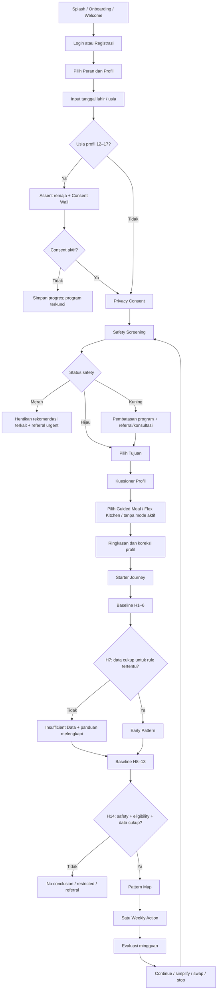

# SARIRA — User Flow

**Status:** Phase 0 logical flow; bukan desain layar

## Alur Utama dan Guard

## Cabang Wajib

### Remaja

Jika usia 12–17, sistem meminta assent pengguna dan consent wali terverifikasi. Tanpa consent: onboarding dapat disimpan, konten edukasi publik yang aman boleh terlihat, tetapi profil health program, baseline, dan rekomendasi tidak aktif. Saat berusia 18, sistem memulai transisi consent/kepemilikan sebelum rekomendasi berikutnya.

### Dewasa

Consent mandiri. Jika tujuan “menambah tinggi/growth” dipilih, sistem menjelaskan batas biologis/non-janji dan menawarkan postur, fleksibilitas, kekuatan inti, mobilitas, atau kesehatan tulang.

### Lanjut Usia

Sistem menawarkan (tidak memaksa) pendamping; screening mencakup jatuh/mobilitas sesuai rule tervalidasi. Jika input wearable tidak tersedia, alur manual tidak dianggap inferior. Copy dan interaksi harus mudah dibaca.

### Orang Tua dengan Profil Anak

Sistem memverifikasi hubungan/otorisasi, meminta usia dan data anak, menjelaskan teknik pengukuran, lalu menampilkan tren. Single measurement, foto, atau questionnaire tidak dapat memicu label stunting; rule dapat meminta pengukuran ulang atau referral.

### Safety Hijau

Program berjalan, tetapi UI menyatakan hijau hanya berarti tidak ada red/yellow trigger dari data yang tersedia. Re-screen pada data baru atau interval yang ditetapkan rule.

### Safety Kuning

Sistem menampilkan alasan, tindakan kehati-hatian, batas program/Weekly Action, dan rujukan konsultasi. Logging/edukasi berisiko rendah boleh tetap tersedia hanya jika rule menyatakan `allowed`.

### Safety Merah

Sistem menghentikan/suppress saran yang dapat menunda bantuan, menampilkan instruksi sesuai urgensi/lokasi, menyediakan acknowledgement, dan mempertahankan akses ke informasi keselamatan. AI tidak memparafrase urgensi di luar template yang disetujui.

### Baseline Tidak Cukup

Early Pattern/Pattern Map hanya dibuat untuk rule yang memenuhi data minimum. Sistem menampilkan data yang kurang, memberikan opsi melanjutkan baseline dalam jendela yang perlu diputuskan, atau mengakhiri tanpa kesimpulan. Tidak ada confidence palsu.

### Izin Data Ditolak

- Izin wearable: manual fallback.
- Notifikasi: jadwal terlihat di aplikasi tanpa push.
- Data opsional domain: rule terkait menjadi tidak tersedia/insufficient; fitur lain tetap berjalan.
- Data wajib untuk keselamatan/eligibility: program tidak dapat dilanjutkan, dengan alasan dan pilihan keluar.

### Guided Meal

Profil → filter safety dan eligibility → kandidat resep approved → ranking deterministik/terkendali → pilih menu → lihat nutrisi/sumber → swap equivalence → log konsumsi aktual. Tidak ada checkout, pembayaran, atau pengiriman.

### Flex Kitchen

Pilih bahan + kuantitas + metode + hasil porsi → validasi allergen/pantangan → kalkulasi database/formula → indikator real-time → alternatif bahan → simpan resep → log porsi aktual. Unknown ingredient menghasilkan `nutrition_unknown`, bukan tebakan AI.

## Global Alternative Flows

- Koreksi tanggal lahir dapat memicu consent/eligibility ulang dan audit.
- Perubahan alergi/pantangan membatalkan kandidat menu lama dan mengevaluasi ulang resep tersimpan.
- Safety trigger baru saat baseline/action langsung mengalihkan flow.
- Rule/evidence diperbarui tidak mengubah histori; rekomendasi baru memakai versi efektif baru.
- Offline menyimpan draft lokal sesuai keputusan keamanan, lalu sinkronisasi dengan conflict handling.

## Acceptance Criteria

- Tidak ada jalur ke rekomendasi sebelum age/consent/safety/eligibility guard.
- Semua cabang memiliki back/exit/save/resume yang aman.
- Red path dapat dicapai dari onboarding, log harian, evaluasi, dan koreksi data.
- Penolakan izin wearable tidak memblokir seluruh produk.
- Mode makanan tidak pernah masuk ke transaksi.

