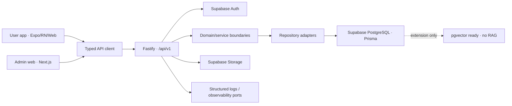

# System Architecture

## Outcome

SARIRA Phase 2 memakai modular monorepo dengan tiga deployable application dan shared packages. UI tidak mengakses database, client tidak menerima private secret, dan rule kesehatan tetap di luar implementasi.

## Layer contract

1. UI renders state and captures input.
2. Feature/provider layer coordinates auth and application use cases.
3. `@sarira/api-client` owns HTTP transport and network errors.
4. Fastify routes authenticate and validate requests.
5. Domain/service boundaries own use-case orchestration.
6. Repositories own persistence.
7. PostgreSQL is authoritative application data storage; Supabase Auth is authoritative identity provider.

`Rules Decide, Evidence Supports, AI Explains` remains the product principle. None of the three engines is implemented in Phase 2.

## Deployable units

| Unit | Runtime | Phase 2 responsibility |
|---|---|---|
| `apps/user-app` | Expo / React Native / Web | Auth session, route guards, responsive UI, Phase 1 mock screens |
| `apps/admin-web` | Next.js 16 | Admin auth/access boundary and placeholder shell |
| `apps/api` | Node 22 / Fastify 5 | API v1, validation, authorization, logging, repositories |
| PostgreSQL | PostgreSQL 17 | Foundation entities, migration, audit, consent versioning |

## Trust boundaries

- Expo public variables and Supabase public key are untrusted client configuration.
- API validates every request even if client validation passed.
- Role checks happen at API/data boundary; Next Proxy is only an optimistic gate.
- Service-role key, database credentials, and future AI keys remain server-only.
- Storage is private by default; no health/body-photo bucket exists.
