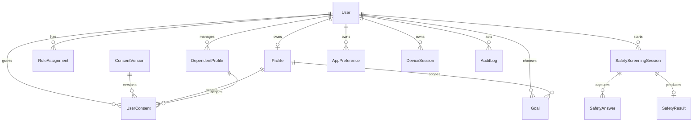

# Data Model

## Constraints

- UUID for every primary/foreign identity.
- `externalAuthId` uniquely maps Supabase identity.
- `Profile.userId` is unique; dependents are separate and repeatable.
- DOB is a date; no persisted age.
- Role assignment unique by user + role.
- Consent version unique by type + version + locale.
- Safety answer unique by session + question.
- Safety result one-to-one with session.
- Cascade ownership deletes are schema-level foundations; legal retention may override application deletion workflow.

No nutrition log, wearable data, health recommendation, embedding, or AI table is introduced in Phase 2.
