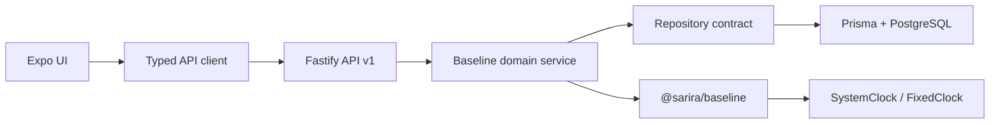

# Baseline Architecture

## Lapisan

- Route menangani parsing, authentication, consent check, dan audit metadata.
- Service menetapkan precondition, ownership, local date, day index, lifecycle refresh, dan edit policy.
- Repository menyediakan operasi agregat yang sama untuk memory test dan Prisma.
- Package domain memuat fungsi murni untuk tanggal, durasi tidur, kelengkapan, readiness, dan konfigurasi.

## Invariant

- Semua data terkait `profileId` dan `baselineSessionId`.
- Partial unique index PostgreSQL mencegah lebih dari satu baseline berstatus aktif/review/insufficient/paused untuk satu profile.
- `DailyRecord` unik berdasarkan `(baselineSessionId, localDate)` serta `(baselineSessionId, dayIndex)`.
- Log tidak menerima `durationMinutes`, `source`, atau `verified` yang authoritative dari client. Backend menetapkan sumber manual dan menghitung durasi tidur.
- Historical read tetap ada setelah consent dicabut; write baru untuk domain terkait ditolak.

## Konfigurasi

`BASELINE_CONFIG` memiliki versi `phase4-dev-v1`, target 14 hari, checkpoint Day 7, extension maksimal 7 hari, bobot empat domain, minimum harian, dan readiness thresholds. Konfigurasi hanya berada di domain/backend; UI membaca hasil, tidak menggandakan rumus.

## Clock

Production menginjeksikan `SystemClock`. Test menginjeksikan `FixedClock`; tidak ada endpoint publik untuk memajukan hari dan system time tidak diubah.
