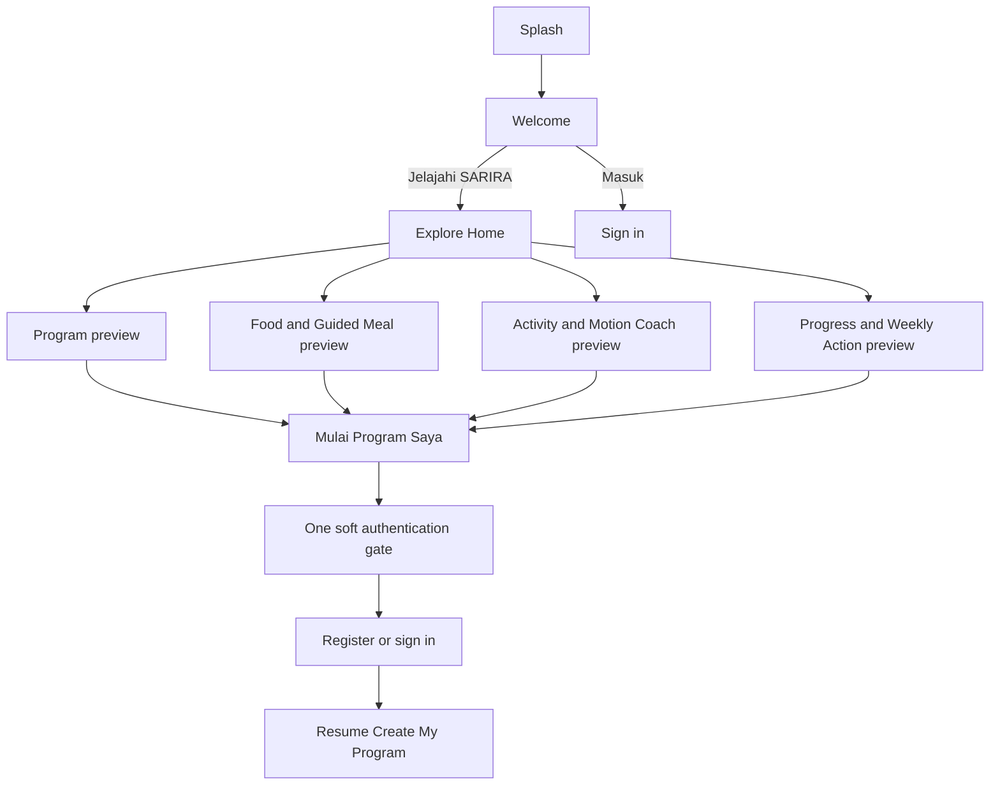

# Guest-First and Soft Authentication Strategy

## Decision

Adopt Guest Explore and delay authentication until a user requests a genuinely personal action. Keep a visible “Masuk” option on Welcome for returning users. Do not repeatedly interrupt browsing with login modals.

## Guest flow

## What a guest may do

- Browse curated program explanations and representative daily plans.
- View meal, recipe, nutrition summary, activity, Motion Coach, progress, Pattern Map, and Weekly Action examples.
- Change public preview filters such as goal category or age-range example if no data is persisted as a real profile.
- Read privacy, safety, help, and non-diagnostic explanations.
- Share/open a public program or recipe preview.

## What requires authentication

| Trigger | Gate copy intent | Resume destination |
|---|---|---|
| Mulai Program Saya | Save safety-aware personal program | Program creation intro |
| Simpan progres / check-in | Keep personal history private | Requested check-in |
| Buat Meal Plan Personal | Use profile and program data | Guided Meal/plan setup |
| Simpan resep | Keep personal recipes | Recipe save confirmation |
| Mulai Coach Session | Record session and progress | Motion Coach preparation |
| Catat makanan/berat/aktivitas | Store personal wellness data | Requested log flow |

## Soft-gate behavior

- Use a bottom sheet for the first gate, not an unexplained redirect.
- State the benefit: “Masuk untuk menyimpan program dan progresmu.”
- Actions: “Daftar,” “Masuk,” and “Nanti.”
- After dismissal, do not show the same gate again during passive browsing.
- After successful auth, restore the intended destination and non-sensitive guest intent.
- Do not claim a preview is personalized. Use “Contoh program” and “Contoh progres.”

## Guest state and conversion

Safe local guest intent may include only:

- last public route;
- selected preview category;
- intended action identifier;
- non-sensitive UI preferences.

Do not store age, weight, health consideration, allergy, safety answer, or free text before a transparent privacy notice and authenticated program-creation context. A conversion payload should be allow-listed, short-lived, versioned, and cleared after success/cancel/expiry.

## Route-guard proposal

1. Public routes allow Splash, Welcome, Explore, and preview details.
2. Personal routes invoke `AuthGate` with the requested destination.
3. Authenticated users without a completed program reach “Lanjutkan pembuatan program,” not a blank Home.
4. Authenticated active users reach the requested personal route.
5. Safety and eligibility checks remain server/engine-authoritative; guest UI never computes a real eligibility result.

## Backend impact summary

- Static/public preview content: **NO CHANGE** if bundled or served by existing public content.
- Resume intent after auth in the same device session: **MINOR LOGIC CHANGE**.
- Persistent anonymous profile, cross-device guest progress, or personal preview results: **SCHEMA CHANGE + MIGRATION REQUIRED** and not recommended for the first refactor.

## Success criteria

- A guest can identify at least three core benefits without login.
- No more than one auth gate appears per explicit personal action.
- Auth success returns to the intended action.
- No real personal data is shown or stored in Guest Explore.
- Deep links preserve the same soft-gate and resume behavior.

