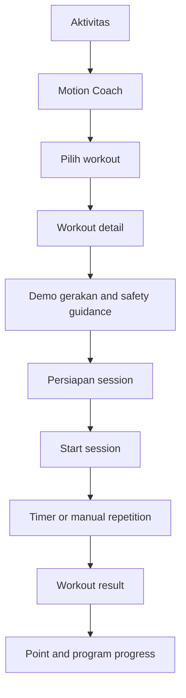
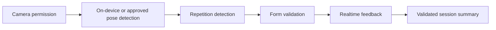

# Motion Coach UX Plan

## Positioning

Motion Coach is a highlighted SARIRA Activity experience. Phase 7.5 defines its UX and future-ready states only. It must not claim camera pose detection, repetition validation, form scoring, or realtime AI feedback is available until separately implemented and validated.

## End-to-end flow

## MVP NOW

- Curated workout library filtered by existing eligibility/safety context.
- Workout cards with level, duration, equipment, and body-neutral photo.
- Exercise detail with instructions, common cautions, and demonstration media if approved.
- Session preparation: space, equipment, sound, and “stop if…” guidance.
- Timed intervals and/or **manual** repetition input.
- Pause, skip, previous/next, end session.
- Session result: duration, exercises completed, self-reported effort, points proposal.
- Clear statement that SARIRA is not currently checking body form through the camera.

## FUTURE AI MOTION VALIDATION

Future examples such as “Posisi punggung sudah baik,” “Lutut sedikit terlalu maju,” or “Repetisi valid: 8” remain conceptual. They require model validation, false-positive analysis, device performance, privacy/security review, consent, accessibility alternative, and safety escalation. They must not be displayed as functional in MVP.

## Key screens

### Motion Coach Home

- Value statement and availability status.
- Today’s eligible workout.
- Browse by time/focus/equipment.
- History and achievements only after the primary action.

### Workout detail

- 4:3 image or approved demonstration preview.
- Workout name, duration, exercise count, intensity, equipment.
- Why it fits the current program.
- Safety notes and modification options.
- Primary “Lihat gerakan” or “Mulai.”

### Session player

- Current exercise, next exercise, timer/manual count.
- Large pause/continue and stop controls.
- Audio/haptic cues optional and user-controlled.
- Screen remains readable at distance and landscape where supported.
- Main app navigation is hidden.

### Result

- “Sesi selesai” without evaluating body quality in MVP.
- Completed duration/exercises and self-reported effort.
- Safe recovery suggestion.
- Points only once per eligible session and with daily caps.

## Safety and accessibility

- Existing safety eligibility cannot be bypassed by deep link.
- Provide seated/low-impact alternatives where approved.
- No shame for skipping, pausing, or ending.
- Instructions have text; audio is not the only channel.
- Reduced-motion mode avoids rapid decorative animation.
- Future camera mode requires a no-camera alternative.
- Emergency/medical language stays outside claims; direct users to appropriate professional help where policy requires.

## Future camera privacy requirements

- Just-in-time permission and explicit purpose.
- Prefer on-device processing; document if frames leave device.
- No recording by default; no hidden upload.
- Separate consent from general app terms.
- Retention/deletion controls and incident monitoring.
- Teen/guardian-specific approval and policy review.

## Acceptance criteria for refactor scope

- Screens distinguish MVP from Future AI unambiguously.
- Manual session is usable without camera.
- No realtime correction or validated repetition is claimed.
- Eligible/safety restrictions remain engine-backed.
- Session UI works with safe area, large text, pause/resume, and screen-reader labels.

