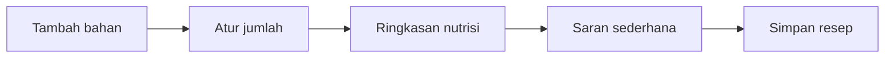

# Food, Nutrition, Guided Meal, and Flex Kitchen UX

## Experience principle

Start with “Hari ini saya makan apa?” and the next meal action. The Nutrition Engine, food database, Meal Planning, recipes, substitutions, and indicators remain intact behind a simpler presentation.

## Makanan Home

```text
Hari ini
Sarapan       Selesai     [Lihat]
Makan siang   Direncanakan [Lihat rencana]
Makan malam   Belum       [Tambah]
Snack         Opsional    [Tambah]

Ringkasan hari ini
Protein cukup untuk saat ini. Tambahkan sayur pada makan berikutnya.
[Lihat indikator nutrisi]
```

Each meal slot shows:

- status;
- simple menu/photo when available;
- short nutrient summary;
- one contextual CTA;
- optional swap/add action in detail.

Do not show all food search, custom food, serving, history, target, source, and indicator controls on this screen.

## Meal logging flow

Meal slot → choose “Gunakan rencana,” “Cari makanan,” “Tambah cepat,” or “Buat sendiri” → amount/portion → preview → save → updated meal status. Keep custom food behind an explicit route. Preserve draft and return to the originating meal.

## Guided Meal

Frame it as “Menu yang disiapkan SARIRA untuk programmu,” not an engine output.

Card/detail hierarchy:

1. Food photo, with reliable fallback.
2. Menu name and meal slot.
3. Cooking time and portion.
4. Two or three program-relevant nutrients, not a data wall.
5. “Mengapa menu ini” in plain language.
6. Primary “Mulai memasak.”
7. Secondary “Lihat resep” and “Ganti menu.”

If recommendation data is incomplete, state it honestly and offer a safe general menu; never show `UNKNOWN`, rule IDs, or snapshot versions.

## Recipe and cooking mode

- Recipe detail: photo, time, portions, ingredients, concise steps, substitutions, key nutrition, start cooking.
- Cooking mode: one step at a time, large next/back controls, keep-awake consideration, timer, no bottom navigation.
- Completion: confirm serving/logging; do not automatically assume consumption.
- Substitute: explain effect in simple terms, with advanced nutrition detail expandable.

## Flex Kitchen

Recommended progressive flow:



- Ingredient search and recent/favorite ingredients first.
- Quantity stepper and unit picker.
- Simple balance summary with one suggested adjustment.
- Full nutrient numbers behind “Lihat detail.”
- Save/name recipe only after the composition is useful.
- Preserve existing substitution and nutrition logic.

## Nutrition summary levels

| Level | Surface | Content |
|---|---|---|
| 1 | Home | Meal completion and one sentence |
| 2 | Makanan Home | Meal slots and compact daily balance |
| 3 | Nutrition detail | Energy/macro/key nutrient ranges with plain explanation |
| 4 | Advanced indicator | Minimum/range/upper-bound, evidence and uncertainty; no debug metadata |

“Target” must be distinguished from diagnosis and shown with safety-limited explanations. Unknown/partial data uses “Belum cukup data.”

## Image use

Use a consistent 4:3 photo for Guided Meal, recipe, and selected meal cards. Do not use photos in nutrition tables, safety warnings, empty/error states, or compact log rows when they displace useful content.

## Accessibility and safety

- Do not encode “good/bad” foods using green/red alone.
- Allergies and restrictions are always visible in confirmation and substitution flows.
- Portion/unit labels are explicit.
- Meal completion does not award additional points for eating less.
- Avoid restrictive or appearance-based copy.
- Advanced values have text explanations and are not the only way to understand the day.

## Acceptance criteria

- Food Home opens with meal slots, not a multi-form workspace.
- A user can log a planned meal in a short, recoverable flow.
- Guided Meal shows photo/name/time/portion/key nutrients/recipe/swap/cooking.
- Flex Kitchen initially shows only ingredient, amount, summary, suggestion, and save.
- Existing nutrition/meal engines are not replaced.

