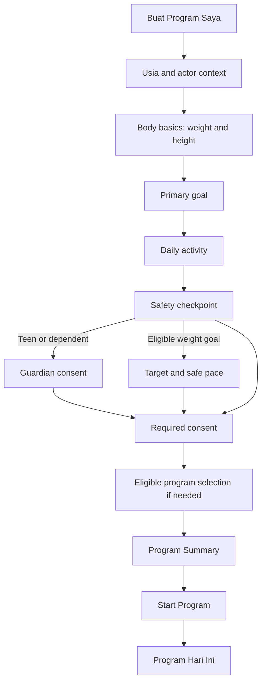

# Create My Program — Proposed Flow

## Product intent

Replace administrative onboarding with a short, safety-aware conversation that produces a visible first program. Existing Safety, Nutrition, Meal Planning, Feature, and Expert System logic remains authoritative; this flow is a presentation and orchestration proposal.

## Recommended core flow

Core screen target: seven screens—age/context, body basics, goal, daily activity, safety, required consent, summary. Guardian, target/pace, and choice are conditional.

## Why weight and height may share one screen

This is one coherent task (“data tubuh dasar”), uses two short controls, and reduces unnecessary transitions. At large text or very small height, the controls stack. If usability testing shows confusion, split them without changing the data model.

## Program outcomes

Possible user-facing program families:

- Program Kelola Berat;
- Program Kebiasaan Sehat;
- Program Aktivitas dan Kebugaran;
- Program Dukungan Pertumbuhan;
- Program Healthy Aging.

Names remain proposals. Availability must be derived from existing age, role, goal, safety, consent, and profile rules. “Program” is not allowed to override an ineligible engine result.

## Conditional question rules

| Condition | Ask now | Skip/defer |
|---|---|---|
| Age 12–17 or dependent context | Guardian/role requirements and teen-safe explanation | Adult-only target controls |
| Weight goal eligible | Target and safe pace constrained by policy | Target if goal is habit/sleep/activity |
| Food personalization requested | Allergy/restriction before meal recommendation | Detailed preferences until first meal plan |
| Activity/Motion Coach chosen | Mobility/safety consideration before workout | Workout preferences until Activity entry |
| Safety response needs restriction | Plain safety result and safe alternatives | Program options prohibited by engine |

## Program summary content

1. Program name and a one-sentence benefit.
2. “Mengapa program ini cocok” using human-readable profile factors.
3. First phase and expected review point; no guaranteed outcome date.
4. What today includes: e.g., check-in, meal, activity, Weekly Action.
5. Personalization still to be completed progressively.
6. Safety boundary and non-diagnostic reminder.
7. Primary “Mulai program”; secondary “Ubah jawaban.”

Do not show internal rule IDs, raw age groups, policy versions, engine names, or confidence scores.

## Program lifecycle

| Stage | User experience | Existing foundation used |
|---|---|---|
| Create | Minimum profile, goal, safety, consent | Phase 3 |
| Baseline | Short daily observations, clearly framed as program setup | Phase 4 |
| Active | Daily program and Weekly Action | Phases 4–7 |
| Review | Progress, Pattern Map, adjustment explanation | Phase 7 |
| Continue/change | Reconfirm goal/safety and propose eligible next program | Existing rules; lifecycle persistence may be future work |

## Save and resume

- Save after each completed answer, but do not auto-submit sensitive consent.
- Show “Tersimpan” as quiet status, never as a layout-breaking row.
- Resume at the first incomplete required step.
- If answers invalidate later conditional answers, explain and clear only affected fields.
- Users can review/edit from summary; returning preserves progress.

## Presentation-only first implementation option

V2 can initially derive the visible program from existing goal, safety, baseline, Weekly Action, and eligible feature data. This avoids rebuilding engines. A persistent Program Enrollment model should be considered only if pause/resume, multiple programs, historic lifecycle, or cross-program analytics are approved; that would be a separate schema/migration decision.

