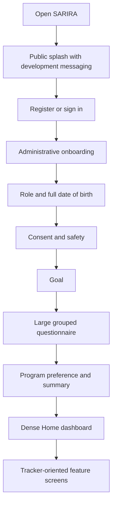
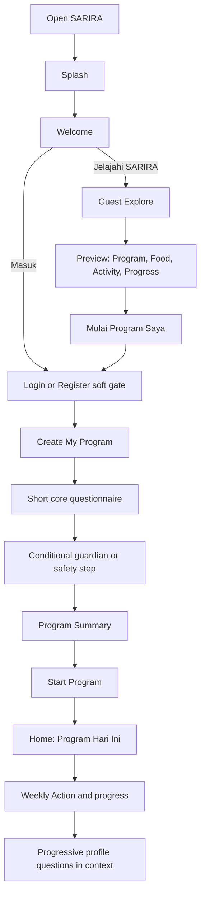

# SARIRA User Flow V2

## Current journey

Current problems: value appears after authentication, account creation is the first major commitment, the questionnaire is long, “program” is not a clear product object, and Home presents many outputs before a next action.

## Proposed V2 journey

## Screen-change map

| Current | V2 decision | Reason |
|---|---|---|
| Technical public splash | Replace | Explain user value, not phase/engine state |
| Login/register as first path | Move | Becomes a soft gate after Explore or an explicit sign-in choice |
| Role screen | Combine/move | Ask “untuk siapa” only if needed for self/dependent flows |
| Full DOB | Remove from UX | Replace with age picker; backend migration plan is separate |
| Guardian consent | Conditional | Shown only to teen/dependent path and cannot be bypassed |
| Privacy/terms definitions inside narrow cards | Redesign | Concise acknowledgement with readable detail sheets/pages |
| Safety screening/result | Keep, redesign | Required and engine-backed; hide rules and versions |
| Goal | Keep | Core program decision |
| Six-section questionnaire | Split and reduce | Core questions now; progressive questions later |
| Program preference | Combine | Present eligible program choices, not engine modes |
| Summary | Keep, redesign | Explain program, reason, pace, safety boundary, and next action |
| Dense Home | Replace hierarchy | Program Today first |
| Food all-in-one | Split | Meal slots → plan/log → detail |
| Activity all-in-one | Split | Today activity → log/history → Motion Coach |
| Progress all-in-one | Split | Program progress → measurements → Pattern/Weekly Action |
| Guest Explore | New | Demonstrates value without personal data |
| Program Home | New | Gives the tracker a coherent program context |
| Progressive profile cards | New | Collect sleep, stress, preferences, and detail when relevant |

## State-specific journeys

### Guest

Explore public examples → choose a benefit → preview its flow → request a personal action → one authentication sheet → resume the intended action after sign-in. No real profile, meal log, measurement, safety answer, or progress is stored as personal data.

### New authenticated user

Create program → answer minimum required information → safety/guardian conditions → review program → start → receive first daily task. A user can stop and safely resume the program-creation draft.

### Active program user

Open Home → complete next task → see updated progress → optionally explore Food/Activity/Progress. Progressive questions appear only when they improve a visible upcoming feature.

### Returning user with incomplete data

Home shows a clear “Lanjutkan program” card and the reason a missing detail matters. The app never empties the entire Home into a generic form.

### Safety-restricted user

The result uses plain, non-diagnostic language, keeps safe general actions available, and explains which personalized options are unavailable. Engine decisions remain authoritative.

## Back/resume/error rules

- Back preserves prior answers and never silently resets consent or safety responses.
- Conditional progress count updates without jumping backward.
- If network submission fails, retain the local draft and offer “Coba lagi.”
- Auth success returns to the action that triggered the soft gate.
- Deep links to personal routes route through authentication then continue, rather than dumping users at Home.
- Guest previews are explicitly labeled “Contoh,” not presented as personalized results.

